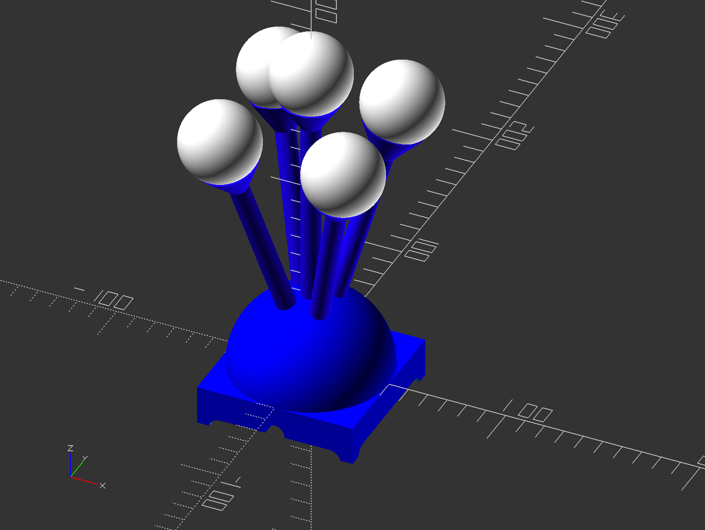

# Beacon
This is a funky looking visual status indicator I made for work:  
  
It has a hemispherical base with 5 stalks ending in cups into which I glued ping-pong balls.  In each ping pong ball is an 8mm addressable through-hole LED.  Wires run down the stalks to a small ATMega32u4 dev board.  

The idea is that you plug it into your computer's USB port and set it at the top of a cube wall.  It lets others around you know if you're there, away, busy, etc.  

The original version was used on a Linux computer, and I added code to Pidgin to change the LED states based on my Skype for Business status.  Now, my work computer is Windows (ugh), and I have to get admin approval to get access to the API for MS Teams - so now I have a separate Windows program where I manually change the LED states.  Progress (nope).

The components:
## avr
This is the AVR code in the dev board.  I don't use Arduino, so this is c++ code compiled and flashed into the chip.  It is a pretty basic project that I've pulled some external stuff into.  In the directories:
+ (root) - has main, a common header, and some basic classes.  `btBootycall` is a OSX application that is used to call the AVR into bootloader 
  +  `sys` - code to set up the hardware and the fuses
  +  `usb` - copied and modified from Atmel's application notes on writing a USB HID device
  +  `ws2812` - a library for ws2812 protocol LEDs

There's a Makefile for linux and mac.  A Windows makefile is left as an exercise for the reader.

## model
This is the OpenSCAD model for the physical device.  Pretty self-explanatory.  

## osx
This is an open-source HID library that I used to make a test app to talk to the beacon for development

## proMicro
Documentation on the dev board